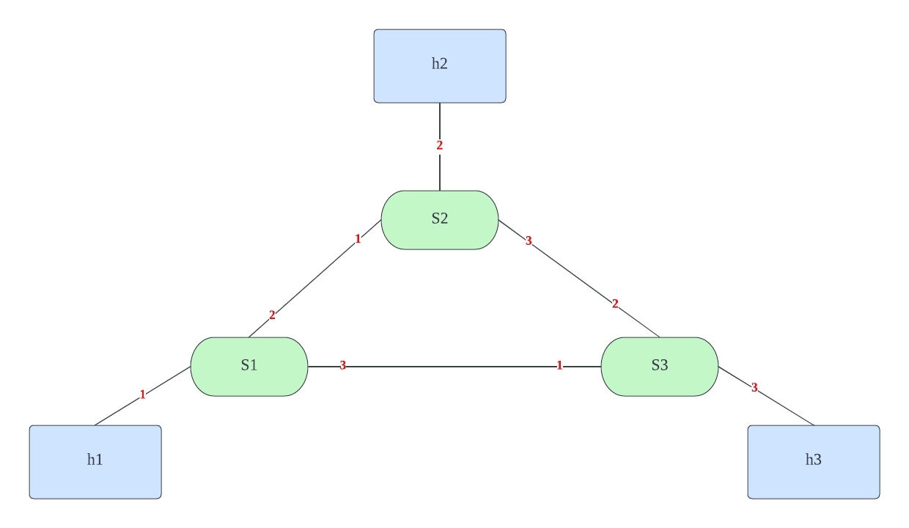

# Firewall Introduction
The goal of this project is to design and implement a firewall on the switch level to block malicious packet transmission to the target host ip address.

## Links
- [Slides](https://docs.google.com/presentation/d/e/2PACX-1vR34U_dEi1h6tlqGXpdISRmFuGV1f35bvppXpVj1oyjQJJwPqCJrc1yMsFZVZtf-g3HbG1wN3U2eyhd/pub?start=true&loop=false&delayms=3000)
- [Demo Video](https://youtu.be/Ub2DVaiTNm0)

## Topology Graph


A design for the test scenior is that: suppose `h2` (10.0.2.2) is a malicious ip destination as opposed to our iot equiment source address `h1` (10.0.0.1), everyelse is connected initially. The functionality of the firewall works when `h1` detects a packet sending to `h2`, the consequent packets sending to `h2` are supposed to be blocked at `s1`.

## Test Instruction
0. make sure you are in the p4 virtual machine build by [vagrant](https://github.com/p4lang/tutorials)@p4 account.
1. run `make` to install the table in topo for switches.
2. run `sudo python3 controller.py` to build the topology for the switches and host machines in mininet by p4runtime.
3. run `xterm h1 h2 h3` to create 3 consoles for `h1`, `h2` and `h3`.
4. at `h2` and `h3` console, run `sudo python3 receive.py`.
5. before blocking any switch, use `sudo python3 send.py h2/h3 'i love p4'` should appear packet info at `h2/h3` console, and the connections are green in the `controller.py`.
6. then we run `python3 block.py h2` in another bash terminal, it should suddenly see that `s1 disconnects s2` in the `controller.py` and the connection becomes red between `s2`.
7. in the `h1` xterm console, we cannot send to `h2`, but `h3` should work fine.

## Implementation
A few dynamic changes make p4 hard to change the table rules by its native rules. Therefore, we use the p4 runtime as the middleware to 1).delete exist table. 2). change the table rule to drop the packet.

### Delete Table
The implementation for deleting the table is achieved by adding another function in `utils/p4runtime_lib/switch.py`, the basic understanding is to tune to proto buffer type to `DELETE` and rewrite the request in the p4 runtime bmv2 model.

```
    def DeleteTableEntry(self, table_entry, dry_run=False):
        request = p4runtime_pb2.WriteRequest()
        request.device_id = self.device_id
        request.election_id.low = 1
        update = request.updates.add()
        # Assign DELETE Type for it
        update.type = p4runtime_pb2.Update.DELETE
        update.entity.table_entry.CopyFrom(table_entry)
        if dry_run:
            print("P4Runtime Delete: ", request)
        else:
            self.client_stub.Write(request)
```

### Drop Table
Based on `basic.p4` MyIngress table rule, the table rule for `ipv4_lpm` is as following:

```
    table ipv4_lpm {
        key = {
            hdr.ipv4.dstAddr: lpm;
        }
        actions = {
            ipv4_forward;
            drop;
            NoAction;
        }
        size = 1024;
        default_action = drop();
    }
```

The corresponding build drop entry in the controller is implemented as:

```
    table_entry = p4info_helper.buildTableEntry(
        table_name="MyIngress.ipv4_lpm",
        match_fields={
            "hdr.ipv4.dstAddr": (dst_ip_addr, 32)
        },
        action_name="MyIngress.drop"
    )
    ingress_sw.WriteTableEntry(table_entry)
```
### DNS Server
We do not implement the real dns server. Instead, We use the socket `gethostbyname` method to get the ipv4 address of the host `h2` and `h3`. Before that, we changed the file `/etc/hosts` where added the map between host name to ipv4 addresses.

